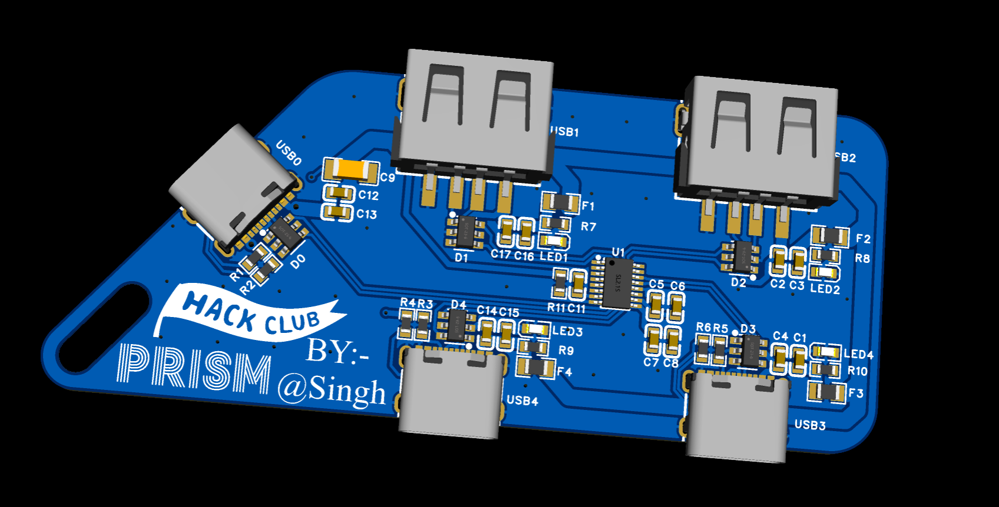
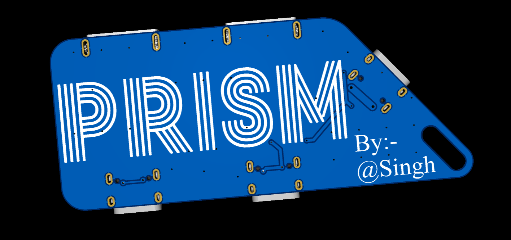
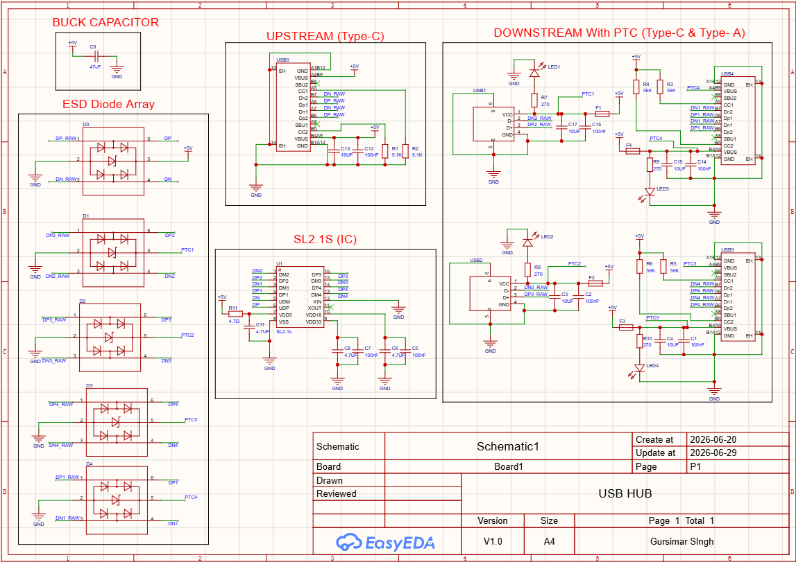
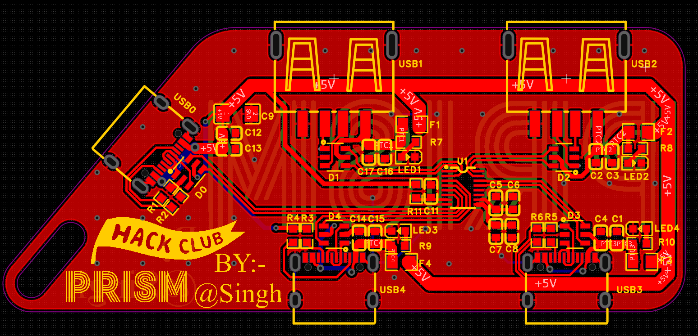
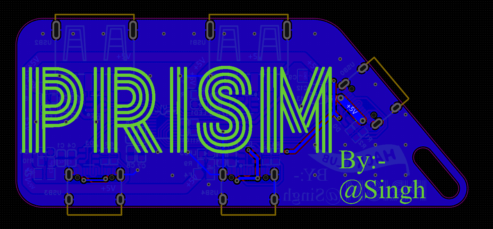
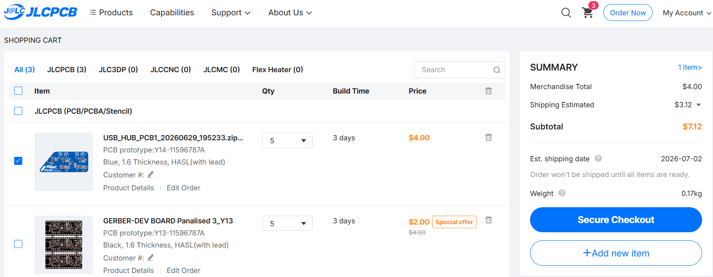

# 'PRISM' The USB Hub V1.0

### A compact 4-port USB 2.0 hub PCB featuring ESD protection,  PTC resettable fuses, and per-port LED indicators. 

[Key Features](#key-features) • [PCB](#pcb) • [BOM](#bom) • [License](#license)

## About

PRISM is a USB Type-C-based input USB hub that splits it into four downstream ports — just like a prism splits light. 
Built from scratch using EasyEDA Pro, this project pushed me deep into reading datasheets, understanding circuit protection, 
and the difference between making something work and engineering something worth making.

## Key Features

- **SL2.1S** USB 2.0 hub controller IC
- **1× USB-C** upstream port with 5.1kΩ CC pull-downs
- **2× USB-C** downstream ports with 56kΩ CC pull-ups
- **2× USB-A** downstream ports
- **USBLC6-2SC6 ESD protection** on all 5 ports — 
  protects data lines from static spikes on plug/unplug
- **PTC resettable fuses** on all 4 downstream ports — 
  self-resetting overcurrent protection, not one-time use
- **Per-port red LED indicators** with required resistors
- **Multi-stage decoupling and power filtering** throughout — 
  bulk cap on main rail, RC filter on IC VBUS, paired caps 
  on all IC power pins and downstream ports per the official 
  SL2.1S reference schematic
- Compact 2-layer PCB, designed to be a keychain at ~3" × 1.25".

## PCB

Designed in EasyEDA Pro.

### Schematic

### PCB

**Front:**

**Back:**

### JLCPCB Order

## BOM

| Designator | Component | Value / Part | LCSC # |
|---|---|---|---|
| U1 | Hub IC | SL2.1S | C2684433 |
| D0–D4 | ESD Protection | USBLC6-2SC6 SOT-23-6 | C7519 |
| F1–F4 | PTC Resettable Fuse | 0805L050WR 500mA | C207022 |
| LED1–LED4 | LED | XL-1608SURC-06 Red 0603 | C965799 |
| R7–R10 | LED Resistor | 270Ω 0603 | C2907020 |
| R11 | VBUS Filter Resistor | 4.7Ω 0603 | C25244 |
| R1, R2 | Upstream CC Resistor | 5.1kΩ 0603 | C2907044 |
| R3–R6 | Downstream CC Resistor | 56kΩ 0603 | C2907184 |
| C1,C2,C5,C7,C12,C14,C16 | Decoupling Cap | 100nF 0603 | C1590 |
| C3,C4,C13,C15,C17 | Port Decoupling Cap | 10µF 0603 | C1691 |
| C6,C8,C11 | IC Decoupling Cap | 4.7µF 0603 | C1705 |
| C9 | Bulk Cap | 47µF 1206 | C5448950 |
| USB0,USB3,USB4 | USB-C Connector | TYPE-C 16PIN 2MD(073) | C2765186 |
| USB1,USB2 | USB-A Connector | 10.0 QHHTZB6.3 | C668591 |

## What I Learned

- How to read IC datasheets and follow reference schematics 
  instead of just tutorials
- Why capacitors are used in pairs — larger caps filter slow 
  transients, smaller caps catch high-frequency noise
- What ESD diodes and PTC fuses actually do 
- Differential pair routing and why length matching matters

## Credits

This project uses:

- [EasyEDA Pro](https://pro.easyeda.com/) for schematic 
  and PCB design
- [JLCPCB](https://jlcpcb.com/) for PCB fabrication
- [LCSC](https://www.lcsc.com/) for component sourcing
- Based on the [Hack Club USB Hub guide](https://macondo.hackclub.com/docs/usb-hub)

## License

MIT
