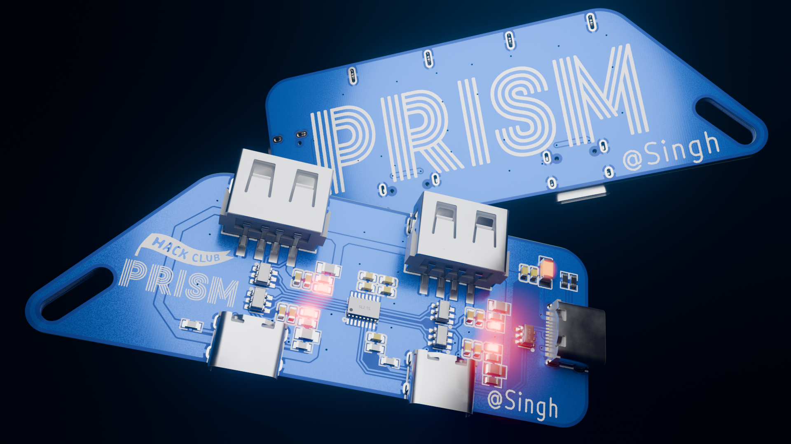
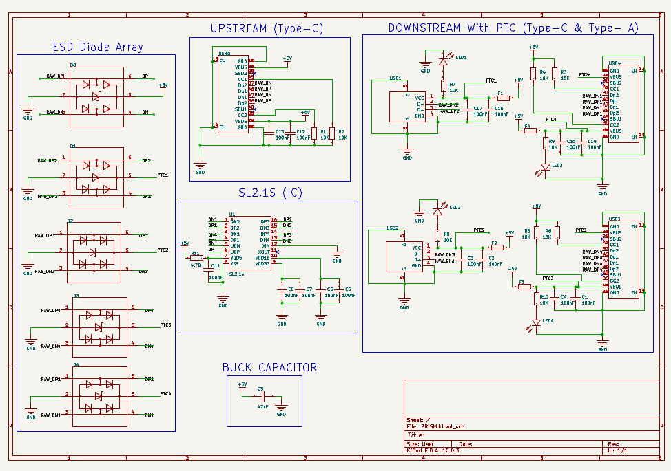
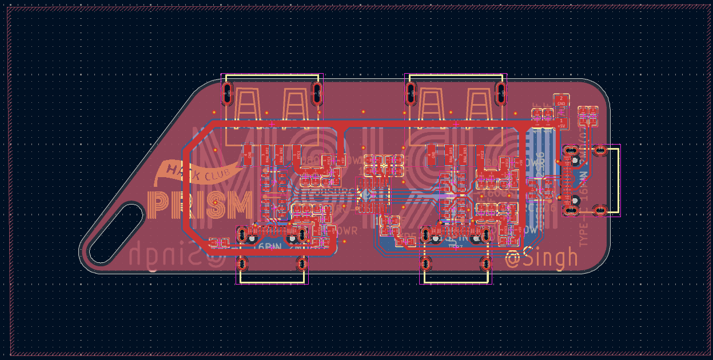
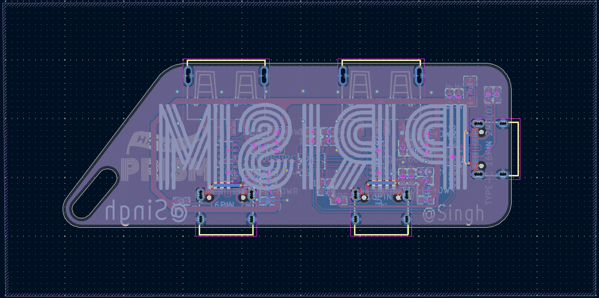
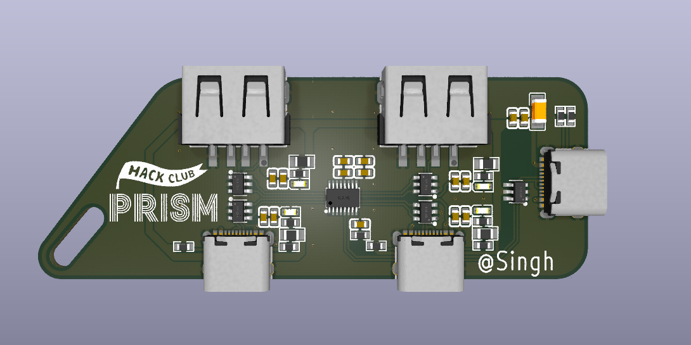
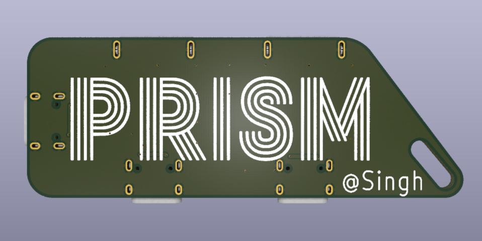

# 'PRISM' The USB Hub V2.0

### A compact 4-port USB 2.0 hub PCB featuring ESD protection,  PTC resettable fuses, and per-port LED indicators; All packed in a small keychain design form.

[Key Features](#key-features) • [PCB](#pcb) • [BOM](#bom) • [License](#license)

## About

PRISM is a USB Type-C-based input USB hub that splits it into four downstream ports — just like a prism splits light. Built from scratch starting in EasyEDA Pro(V1), later moving to KiCad and finishing off with Blender animated renders, this project pushed me deep into reading datasheets, understanding circuit protection, and the difference between making something work and engineering something worth making.

## Key Features

- Main IC - SL2.1S (IC)
- Static Circuit Protection - ESD diodes on all ports
- Short-Circuit protection - PTC on all downstream ports
- Downstream port features - 2x USB-Type-C
                           - 2x USB-Type-A
- Upstream port - USB-Type-C
- Multi-Layer capacitor decoupling
- Compact 2-layer PCB, designed to be a keychain at ~3" × 1.2".

## PCB

Designed in EasyEDA Pro(V1), Further Refined in KiCad(V2).

### Schematic

### PCB

**Front:**

**Back:**

### KiCad Renders 

**Front:**

**Back:**

## BOM

Note: The official LCSC BOM is in the production folder.

## What I Learned

- How to read the reference schematic provided by the manufacturer
- In-depth functionality of capacitors - Why they are used in pairs
- Functionality of ESD & PTC
- Difference in USB types and their speeds
- Differential pair routing and its importance

## Credits

This project uses:

- [EasyEDA Pro](https://pro.easyeda.com/) 
- [KiCad](https://www.kicad.org/download/)
- [JLCPCB](https://jlcpcb.com/) for PCB fabrication
- [LCSC](https://www.lcsc.com/) for component sourcing
- Based on the [Hack Club USB Hub guide](https://macondo.hackclub.com/docs/usb-hub)

## License

MIT
