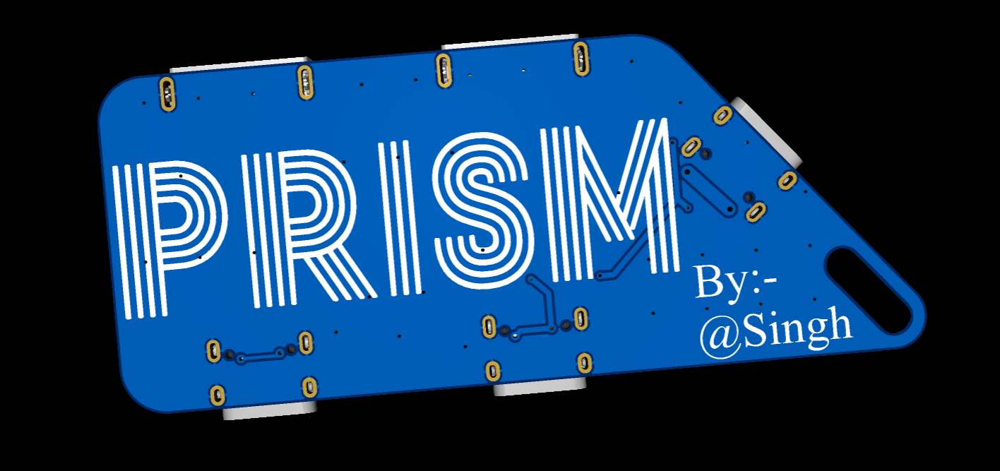
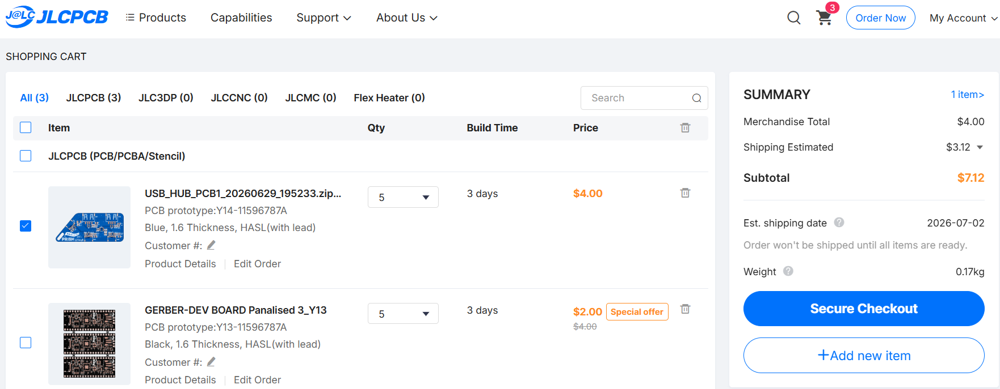

# 'PRISM' The USB Hub V1.0

### A compact 4-port USB 2.0 hub PCB featuring ESD protection,  PTC resettable fuses, and per-port LED indicators. 

[Key Features](#key-features) • [PCB](#pcb) • [BOM](#bom) • [License](#license)

## About

## Key Features

## PCB

Designed in EasyEDA Pro.

### Schematic

### PCB

**Front:**

**Back:**

### JLCPCB Order

## BOM

## What I Learned

## Credits

This project uses:

- [EasyEDA Pro](https://pro.easyeda.com/) for schematic 
  and PCB design
- [JLCPCB](https://jlcpcb.com/) for PCB fabrication
- [LCSC](https://www.lcsc.com/) for component sourcing
- Based on the [Hack Club USB Hub guide](https://macondo.hackclub.com/docs/usb-hub)

## License

MIT
